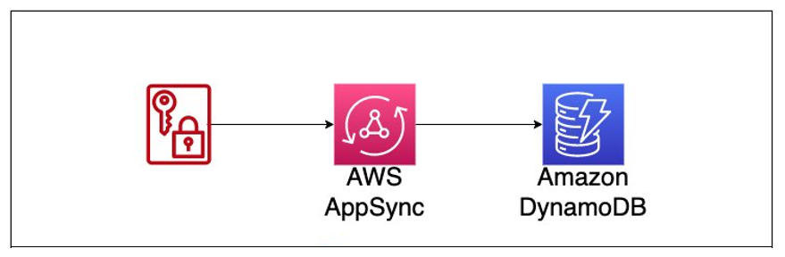
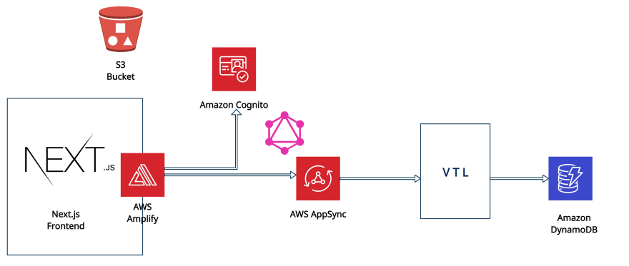

# Simple Secure AWS AppSync with API Keys and DynamoDB

This repo walks through the steps needed to get setup an AppSync API that is protected with an API Key.

```typescript
const api = new GraphqlApi(this, "User API", {
  name: "User API",
  schema: SchemaFile.fromAsset(path.join(__dirname, "graphql/schema.graphql")),
  authorizationConfig: {
    defaultAuthorization: {
      authorizationType: AuthorizationType.API_KEY,
      apiKeyConfig: {
        description: "public scan for Users",
        expires: Expiration.after(Duration.days(30)),
        name: "API Key for demo",
      },
    },
  },
});
```



## Project Overview

The deployed project is meant to work with a frontend (e.g NextJS), thereby creating a fullstack application.



To deploy an API for client usage, we can use the following command.

- `cdk deploy --outputs-file ./output.json`
  => The output.json file is generated containing the necessary configuration information for the client
- On the frontend, use of the AWS Amplify JS libraries are used to connect our frontend to our backend by means of the Amplify.configure method (sample data configs are used):

- ```typescript
  Amplify.configure({
    aws_project_region: "ap-northeast-1",
    aws_appsync_graphqlEndpoint: "your aws_appsync_graphqlEndpoint",
    aws_appsync_region: "ap-northeast-1",
    aws_appsync_authenticationType: "API_KEY",
    aws_appsync_apiKey: "your aws_appsync_apiKey",
  });
  ```

```

This is a blank project for CDK development with TypeScript.

The `cdk.json` file tells the CDK Toolkit how to execute your app.

## Useful commands

- `npm run build` compile typescript to js
- `npm run watch` watch for changes and compile
- `npm run test` perform the jest unit tests
- `cdk deploy` deploy this stack to your default AWS account/region
- `cdk diff` compare deployed stack with current state
- `cdk synth` emits the synthesized CloudFormation template
```
